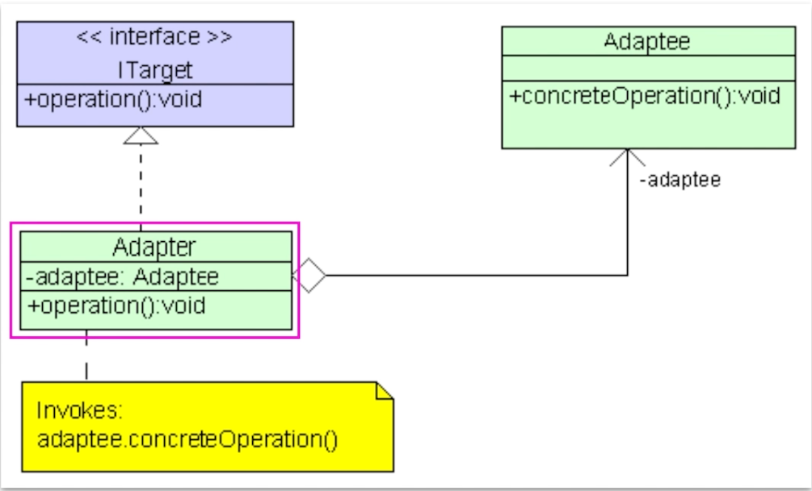
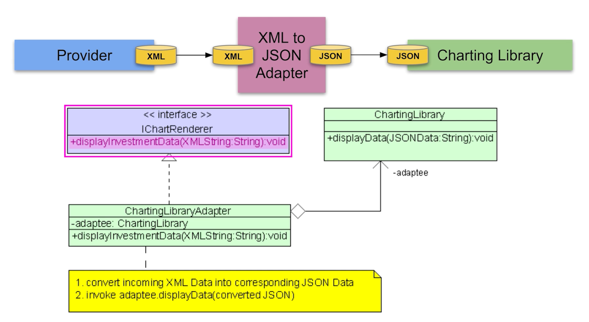

# Adapter Pattern

## Scenario

1. Provider 클래스에서 데이터를 XML로 제공하지만 시각화를 위한 라이브러리에서는 JSON만을 받을때

2. Legacy코드에서는 사각형을 만들때 x, y, w, h를 인자로 받았는데 새로운 사각형 클래스에서는 x1, x2, y1, y2를 인자로 받을때-> interface incompatibility라고 한다.

## Adapter Pattern

- 사용하려는 신규 서비스가 Adaptee에 해당한다.
- ITarget이 사용하려는 기존의 서비스다.
- Adapter라는 Wrapper를 이용해서 두가지 서비스의 변환을 할 수 있다.
- 어댑터는 구조적 패턴이다.
  1. 어댑터는 포맷을 바꿔서 클라이언트가 이해할수 있게 해준다.
  2. 어댑터는 인터페이스가 다른 오브젝트들이 같이 일할 수 있게 해준다.
  3. Bridge, State, Strategy 패턴들도 있다. 이들 모두 기본적으로 다른 오브젝트에게 일들을 delegate 한다.그러나 모두가 다른 문제들을 해결하려한다.
  4. 어댑터는 인터페이스가 다른것을 wrapping 한다. Proxy 패턴은 같은 인터페이스를, Decorator 패턴은 확장된 인터페이스를 제공한다는것에서 차이가 있다.
- 언제 쓸까?
  - 기존의 클래스나 로직이 존재해서 재사용하고 싶지만 인터페이스가 차이가 날때
- 언제 쓰면 안되나?
  - 시스템이 매우 'time sensitive'할 때 wrapper가 만드는 layer가 좋지 않을 수 있다.
  - 이럴때는 오리지널 코드를 다시 쓰는게 나을 수 있다.
- 장점
  - 데이터변환 코드가 비즈니스 로직과 분리를 할 수 있다 -> Single Responsibility Prinicle
  - 기존 코드를 변경하지 않고 어댑터 코드만 추가할 수 있다 -> Open Closed Principle
- 단점
  - 새로운 인터페이스와 클래스가 추가됨으로 코드의 복잡도가 올라간다.

## 고려사항

1. 대상이 되는 서비스(Adaptee, Charting Library)를 파악한다.

2. client interface를 정의 한다.

3. 클라이언트 Interface를 implment해서 Adapter 클래스를 만든다

4. Adaptee object에 대한 레퍼런스를 저장할 수 있는 private field를 adpater내에 정의한다.

5. 어댑터 클래스에서 인터페이스의 method들을 모두 구현한다. 이때 대부분의 로직들은 Adaptee가 하도록 해야되며 어댑터는 변환 로직만 다뤄야한다.

6. 클라이언트(기존 코드)는 항상 어댑터를 통해서만 작동하게 해야한다. 이렇게함으로 클라이언트 코드는 건들이지 않고 어댑터 코드만 조작하면 된다.

7.
